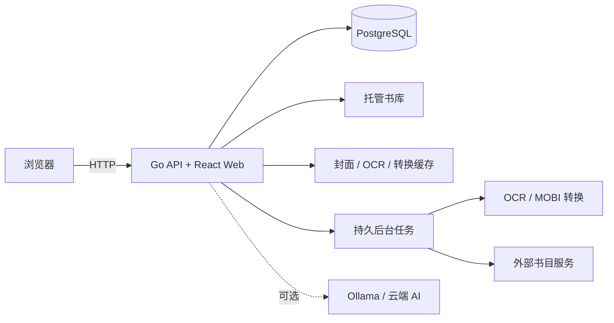

# PEUFMReader

PEUFMReader 是一个面向 NAS 的多用户电子书管理与 Web 阅读应用。它将书籍导入、元数据整理、分类、检索、阅读和进度记录集中在一个自托管服务中，适合家庭或小团队在局域网使用。

项目当前以约 10 个用户、3000 本书为设计基线，使用 Docker Compose 部署，支持 PDF、EPUB、MOBI 和 AZW3。

> 当前仓库仍处于持续开发阶段。局域网部署已经可用；公网访问必须放在受信任的 HTTPS 反向代理或私有网络之后。

## 功能概览

### 书库管理

- 浏览器批量上传 PDF、EPUB、MOBI、AZW3。
- SHA-256 文件去重和真实格式签名校验。
- 原文件复制到应用托管书库，不依赖原始上传位置。
- Calibre 书库只读扫描、预览和可恢复批量迁移。
- 移动导入箱：自动处理稳定写入的电子书，成功后归档源文件。
- 只读监控目录：递归增量扫描已有 NAS 书库，复制入库且不改动源文件。
- 首页提供继续阅读、热门书籍、最近加入、题材分类和个人统计。
- 独立书籍详情页、收藏书架和多信号个性化推荐；推荐显示作者、题材、热度等原因，并支持“感兴趣/不感兴趣”反馈。
- 服务端全文条件搜索、分页、排序和分类筛选。
- 管理员可批量修改版本元数据、合并重复作品/版本，并通过可视化关键词规则控制后续自动分类。
- 支持本地账号、OIDC 和 LDAP；管理员可按用户为单本或一批书设置显式允许/拒绝规则。

### 阅读器

| 格式 | 浏览器阅读方式 | 主要能力 |
| --- | --- | --- |
| PDF | PDF.js | 单页/双页、连续滚动、缩放、目录、页码跳转、搜索、文本高亮、书签/笔记、键盘操作 |
| EPUB | epub.js | 分页/连续滚动、字号、主题、目录、搜索、文本高亮、书签/笔记、键盘操作 |
| MOBI/AZW3 | 导入时生成 EPUB 阅读缓存 | 复用 EPUB 阅读能力，原文件仍被保留 |

- 每位用户独立保存阅读位置、整体进度、阅读状态和有效阅读时长。
- 每位用户可在稳定的 PDF 页码或 EPUB CFI 位置添加、编辑、定位和删除私有书签、文本高亮及笔记；高亮支持五种颜色和可选批注，并可按单本书导出 Markdown 或 JSON。
- 每位用户可创建独立设备令牌，通过 OPDS 1.2 浏览/下载书籍，并与 KOReader 或 Kobo 状态桥接同步进度。
- 阅读缓存可以删除和重新生成，不修改原始电子书。
- 不支持受 DRM 保护的 MOBI/AZW3，也不提供 DRM 移除功能。

### 外部阅读器

登录后进入“设备同步”页面创建令牌。令牌只在创建时显示一次，可以单独撤销，不需要向设备提供网页登录密码。

- OPDS 目录：`https://你的域名/opds/v1.2/catalog`，使用用户名和设备令牌进行 HTTP Basic Auth。
- KOReader 同步服务：`https://你的域名/api/koreader`，兼容 `X-Auth-User` / `X-Auth-Key` 认证与进度接口。
- Kobo 状态桥接：`/api/kobo/v1/library/{书籍ID}/state`，供自建 Kobo 插件或自动化脚本读写进度；这不是 Kobo 官方云服务的替代实现。
- KOReader 文档键使用 `peufm:书籍ID`、书籍 SHA-256 或原文件名时，会自动关联 Web 端同一用户的阅读进度。

### 元数据与分类

- 提取 EPUB OPF、PDF Info 和 Calibre `metadata.opf`。
- PDF 首页封面、原生文本提取和可选中英文 OCR。
- 按作者、出版年份和管理员维护的层级题材体系分类；内置规则覆盖全部固定分类，并包含中国古典与国学、人际关系与沟通、极简生活等中文书库常用子类。
- 分类 v2 区分强关键词与普通关键词：强书名信号可直接采用，普通词需要题材或多字段证据共同达到阈值；每项结果保留命中理由和置信度。
- 保存元数据证据、来源、置信度和管理员审核结果。
- 可选 Ollama 或 OpenAI-compatible AI 分类建议。
- 支持 Open Library、Google Books 和独立 `douban-api-rs` 豆瓣服务。
- 外部来源可配置启用状态、地址、优先级、超时、候选数和导入后自动查询。
- 外部书目字段只生成建议，不会覆盖管理员确认的数据；高置信 ISBN 或“书名＋作者”匹配可作为分类证据，低置信匹配仍进入人工审核。

管理员可在“管理后台 → 目录维护 → 可视化分类规则”编辑两类关键词和同分优先级。修改规则后点击“重新分类未归类书籍”会创建可恢复后台任务；任务只处理没有已采用分类的版本，不覆盖任何人工分类。

### 多用户与运维

- `admin`/`reader` 角色、本地账号和 Argon2id 密码哈希。
- 管理员可查看登录记录、活跃会话、最近访问、阅读统计并下线设备。
- HttpOnly 会话 Cookie、CSRF 防护、登录限流和操作审计。
- PostgreSQL 持久后台任务、任务租约、失败重试和重启恢复。
- 书库一致性检查、数据库导出、文件快照和校验恢复。

## 技术架构



- 后端：Go、`net/http`、pgx。
- 前端：React、TypeScript、Vite、PDF.js、epub.js。
- 数据库：PostgreSQL 18。
- 文档处理：Poppler、Tesseract OCR、libmobi。
- 部署：Docker Compose，应用容器以非 root 用户运行。

## 快速启动

### 运行要求

- Docker Engine 或 Docker Desktop。
- Docker Compose v2。
- 至少 2 GB 可用内存；运行大量 PDF OCR 时建议 4 GB 以上。
- 当前已验证镜像平台为 `linux/amd64`。

克隆仓库：

```sh
git clone https://github.com/Iamsxd/PEUFMReader.git
cd PEUFMReader
```

复制配置：

```sh
cp .env.example .env
```

至少修改以下两项，且不要复用同一个密码：

```dotenv
POSTGRES_PASSWORD=replace-with-a-long-random-database-password
ADMIN_PASSWORD=replace-with-a-long-random-admin-password
```

启动：

```sh
docker compose up -d --build
docker compose ps
```

浏览器打开：

```text
http://服务器IP:8080
```

查看日志：

```sh
docker compose logs -f app
```

停止服务：

```sh
docker compose down
```

`docker compose down` 不会删除绑定挂载的数据。除非已经验证备份，否则不要执行 `docker compose down -v`，也不要删除 `PEUFM_DATA_ROOT`。

## Unraid / NAS 部署

建议把源码与运行数据分开：

```text
/mnt/user/appdata/peufmreader-stack   # Git 仓库与 compose.yaml
/mnt/user/appdata/peufmreader         # 数据库、托管书库和缓存
/mnt/user/ebooks/peufmreader-import   # 可选自动导入目录
/mnt/user/ebooks/library             # 可选只读监控的现有电子书目录
/mnt/user/backups/peufmreader         # 备份快照
```

在 `.env` 中设置：

```dotenv
PUID=99
PGID=100
TZ=Asia/Shanghai
APP_PORT=8080

PEUFM_DATA_ROOT=/mnt/user/appdata/peufmreader
PEUFM_IMPORT_ROOT=/mnt/user/ebooks/peufmreader-import
WATCH_LIBRARY_ENABLED=true
WATCH_LIBRARY_PATH=/mnt/user/ebooks/library
WATCH_LIBRARY_SCAN_INTERVAL=1m
WATCH_LIBRARY_STABLE_AGE=30s
PEUFM_BACKUP_ROOT=/mnt/user/backups/peufmreader
CALIBRE_LIBRARY_PATH="/mnt/user/ebooks/Calibre Library"
```

创建应用可写目录：

```sh
mkdir -p /mnt/user/appdata/peufmreader/{library,staging,cache}
mkdir -p /mnt/user/ebooks/peufmreader-import
mkdir -p /mnt/user/backups/peufmreader
chown -R 99:100 /mnt/user/appdata/peufmreader/library \
  /mnt/user/appdata/peufmreader/staging \
  /mnt/user/appdata/peufmreader/cache \
  /mnt/user/ebooks/peufmreader-import \
  /mnt/user/backups/peufmreader
```

检查并启动：

```sh
docker compose config
docker compose up -d --build
docker compose ps
docker compose logs --tail 100 app
```

PostgreSQL 数据必须放在 NAS 本机持久存储，不应放在另一台设备的 SMB/CIFS 网络共享上。数据库端口没有映射到主机，也不应手动向局域网或公网开放。

## 从其他设备迁移现有实例

不要复制正在运行的 PostgreSQL 原始数据目录。使用项目提供的逻辑备份：

```sh
docker compose stop -t 30 app
docker compose --profile tools run --rm -e BACKUP_NAME=migration backup
docker compose start app
```

将 `${PEUFM_BACKUP_ROOT}/migration` 整个目录复制到新 NAS 的备份目录，然后在新设备运行：

```sh
docker compose up -d db
sh scripts/restore.sh migration --yes
docker compose up -d --build
```

恢复会替换目标实例的数据库、托管书库、缓存和导入目录。执行前请确认目标路径和快照名称。

## 主要配置

| 变量 | 默认值 | 说明 |
| --- | --- | --- |
| `APP_PORT` | `8080` | NAS 对外监听端口 |
| `PUID` / `PGID` | `99` / `100` | 应用容器读写文件使用的 UID/GID |
| `PEUFM_DATA_ROOT` | `./data` | PostgreSQL、书库、暂存和缓存根目录 |
| `PEUFM_IMPORT_ROOT` | `./data/import` | 自动导入、成功归档和失败隔离目录 |
| `WATCH_LIBRARY_ENABLED` | `false` | 是否启用只读监控目录的递归增量扫描 |
| `WATCH_LIBRARY_PATH` | `./data/watch-library` | 只读监控的 NAS 电子书目录 |
| `CALIBRE_LIBRARY_PATH` | `./data/calibre` | Calibre 根目录，以只读方式挂载 |
| `MAX_UPLOAD_BYTES` | `524288000` | 单个上传文件最大字节数 |
| `SESSION_TTL` | `720h` | 登录会话有效期 |
| `COOKIE_SECURE` | `false` | 仅通过 HTTPS 访问时设置为 `true` |
| `PUBLIC_ACCESS` | `false` | 启用公网防误配校验、Host 白名单、代理 HTTPS 校验和 HSTS |
| `PUBLIC_URL` / `ALLOWED_HOSTS` | 空 | 公网根地址及允许的请求 Host |
| `OIDC_ISSUER_URL` | 空 | OIDC Discovery 地址；非空时启用统一身份认证 |
| `LDAP_URL` | 空 | `ldap://` 或 `ldaps://` 服务地址；非空时启用 LDAP 登录 |
| `PDF_OCR_MODE` | `auto` | `auto`、`always` 或 `disabled` |
| `PDF_OCR_MAX_PAGES` | `8` | 扫描版 PDF 最多 OCR 前几页，避免长书占用后台任务 |
| `BIBLIOGRAPHY_PROVIDERS` | `openlibrary` | 首次启动时初始化启用的外部来源 |

完整配置及 AI、OCR、Google Books、豆瓣服务示例见 [.env.example](.env.example)。

## 身份认证与书库权限

- OIDC 使用 Authorization Code Flow、PKCE、state 和 nonce；回调地址是 `/api/v1/auth/oidc/callback`。
- LDAP 先使用可选的只读服务账号搜索唯一用户 DN，再使用用户密码绑定；推荐 `ldaps://`，或启用 StartTLS。
- 外部身份首次登录时自动建立应用账号。已有本地用户名不会被外部身份自动接管，OIDC/LDAP 管理员组可映射为应用管理员。
- 书库权限默认允许，以兼容现有安装。管理后台可搜索并批量设置单书“允许”“拒绝”或“恢复默认”；拒绝会覆盖网页目录、文件内容、封面、OPDS 与设备进度接口。
- 管理员不受逐书拒绝规则限制。若希望使用“默认拒绝、按书授权”的共享书库模型，可在后续版本增加书库/分组级策略；当前版本应由管理员批量拒绝不应可见的书。

> PostgreSQL 初始化完成后，修改 `.env` 中的 `POSTGRES_PASSWORD` 不会自动修改数据库内已有角色密码。管理员账号已存在时，修改 `ADMIN_PASSWORD` 也不会重置该账号密码。请使用管理后台修改账号，数据库密码则应在计划维护窗口内同步修改。

## 外部书目信息源

进入“管理后台 → 外部书目信息源”即可配置：

- 启用或停用来源。
- 服务地址、查询优先级、超时时间和最大候选数。
- “保存并测试”以及最近成功时间、响应耗时和最近错误。
- 导入后自动查询建议。

豆瓣书目源需要单独运行兼容服务，并填写其根地址，例如：

```text
http://192.168.3.118:5890
```

启用公网服务意味着书名、作者、ISBN 和语言等信息可能发送给第三方，请根据书库隐私要求决定是否开启。

## AI 分类

AI 默认关闭，不影响导入、规则分类和人工整理。局域网 Ollama 示例：

```dotenv
AI_PROVIDER=ollama
AI_BASE_URL=http://192.168.1.10:11434
AI_MODEL=qwen3:8b
```

OpenAI-compatible 服务示例：

```dotenv
AI_PROVIDER=openai-compatible
AI_BASE_URL=https://api.example.com
AI_MODEL=provider-model-name
AI_API_KEY=replace-with-provider-api-key
```

AI 只提供分类建议，不能直接覆盖人工确认结果。使用云端服务意味着相关书目元数据会离开局域网。

## Calibre 与自动导入

`CALIBRE_LIBRARY_PATH` 以只读方式挂载到 `/import/calibre`。管理员可以先扫描预览，再将选中的 PDF、EPUB、MOBI、AZW3 复制到应用书库；原 Calibre 文件不会被修改或删除。

也可以将文件放入 `${PEUFM_IMPORT_ROOT}/inbox`。文件大小和修改时间稳定后会自动排队：

- 成功文件归档到 `processed/年-月`。
- 连续失败文件隔离到 `failed/任务标识`，同时写入错误说明。
- 后台任务在服务重启后继续处理。

网页批量上传会一直保留，适合临时导入或作为目录扫描之外的备用入口。除此以外有两种自动目录模式：

| 模式 | 源目录行为 | 适用场景 |
| --- | --- | --- |
| 移动导入箱 | 成功后从 `inbox` 移到 `processed/年-月`；连续失败移到 `failed` | 把目录当作待处理收件箱 |
| 只读监控目录 | 只读递归扫描，复制入库，绝不移动、改名或删除源文件 | 继续保留原有 NAS 文件结构或供其他软件共用 |

启用只读监控目录：

```dotenv
WATCH_LIBRARY_ENABLED=true
WATCH_LIBRARY_PATH=/mnt/user/ebooks/library
WATCH_LIBRARY_SCAN_INTERVAL=1m
WATCH_LIBRARY_STABLE_AGE=30s
```

然后运行 `docker compose up -d`。Compose 会把 `WATCH_LIBRARY_PATH` 挂载为容器内的只读目录。扫描按相对路径、大小和修改时间识别新增或变更文件，导入时仍通过 SHA-256 内容校验去重。删除源文件不会删除应用书库中的副本；失败任务只记录错误并重试，不会隔离或修改源文件。

## 备份与恢复

创建备份：

```sh
sh scripts/backup.sh
# 或指定名称
sh scripts/backup.sh before-upgrade
```

恢复：

```sh
sh scripts/restore.sh before-upgrade --yes
```

备份包含 PostgreSQL 导出、托管书库、缓存和导入目录，并通过 SHA-256 校验。恢复是破坏性操作，会替换当前数据，请先额外保留一份现有目录副本。

## 公网访问

不要直接把应用 HTTP 端口暴露到公网。至少需要：

- 受信任的 HTTPS 反向代理。
- 设置 `PUBLIC_ACCESS=true`、`PUBLIC_URL=https://reader.example.com` 和 `ALLOWED_HOSTS=reader.example.com`。
- 设置 `COOKIE_SECURE=true`，并把 `TRUSTED_PROXY_CIDR` 精确限制为反向代理容器所在网段。
- 反向代理必须传递原始 `Host` 和 `X-Forwarded-Proto: https`。公网模式会拒绝白名单外 Host 和未经受信代理确认的 HTTP 请求，并返回 HSTS、CSP、禁止嵌入等安全头。
- 强随机数据库密码和管理员密码。
- 定期备份并验证恢复流程。
- 不发布 `.env`、数据库目录、书籍文件或备份快照。

如果只是个人远程阅读，优先通过私有网络访问 NAS。

Nginx 反向代理的关键片段：

```nginx
location / {
    proxy_pass http://peufmreader:8080;
    proxy_set_header Host $host;
    proxy_set_header X-Forwarded-Proto $scheme;
    proxy_set_header X-Forwarded-For $proxy_add_x_forwarded_for;
    client_max_body_size 500m;
}
```

## 开发与验证

前端：

```sh
cd web
pnpm install --frozen-lockfile
pnpm test
pnpm build
```

后端：

```sh
cd server
go test ./...
```

本机没有 Go 时可以使用容器：

```sh
docker run --rm -v "$PWD/server:/src" -w /src \
  golang:1.26.5-bookworm /usr/local/go/bin/go test ./...
```

完整 Docker 验证：

```sh
docker compose build
docker compose up -d
docker compose ps
```

性能基线脚本位于 `scripts/performance-seed.sql` 和 `scripts/performance-smoke.mjs`。设计决策、同类项目比较和阶段验证记录位于 [docs](docs/README.md)。

## 项目结构

```text
.
├── server/                  Go API、任务处理和数据库迁移
├── web/                     React Web 应用及阅读器
├── scripts/                 备份、恢复和性能验证脚本
├── docs/                    产品方案、ADR 和验证记录
├── compose.yaml             NAS/本地 Docker Compose 配置
├── Dockerfile               前后端多阶段构建
└── .env.example             配置模板
```

## 已知限制

- 不支持带 DRM 的电子书。
- PDF 字号无法像 EPUB 一样重新排版，阅读器提供的是页面缩放。
- OCR 会消耗较多 CPU 和临时磁盘空间。
- 外部书目服务可能受到网络、频率限制或上游页面变更影响。
- 当前仓库尚未附带开源许可证；公开可见不等同于获得复制、修改或再分发授权。

## 文档

- [NAS Web 实现方案](docs/product/nas-web-implementation-proposal.md)
- [同类 GitHub 项目比较](docs/discovery/github-project-comparison.md)
- [M0 技术验证](docs/validation/m0-technical-validation.md)
- [M1 导入分类验证](docs/validation/m1-import-classification-validation.md)
- [M2 阅读与运维验证](docs/validation/m2-reader-import-operations-validation.md)
